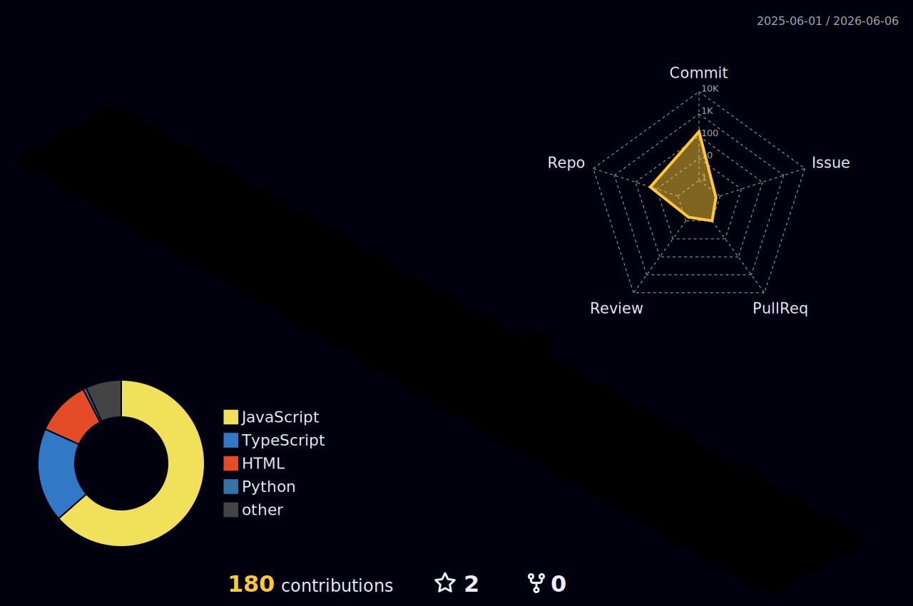

# Hi there, I'm Krido Bahtiar! 👋

  
   
   
  

  

- 🔭 I’m currently building **[Nineteen Dev](https://nineteen-dev.vercel.app)**, a Professional Web & Mobile Development Studio.
- 📝 I regularly write articles and dev logs on my **[Blog](https://nineteen-dev.vercel.app/blog)**.
- 🌱 I’m currently learning **Advanced React Patterns** and **Supabase**.
- 👯 I’m looking to collaborate on open-source projects.
- 💬 Ask me about **React, JavaScript, and Web/Mobile Development**.

 

### 📰 Latest Blog Posts
<!-- BLOG-POST-LIST:START -->
<!-- BLOG-POST-LIST:END -->

 

  

 

  

 

  

 

 

 

  

